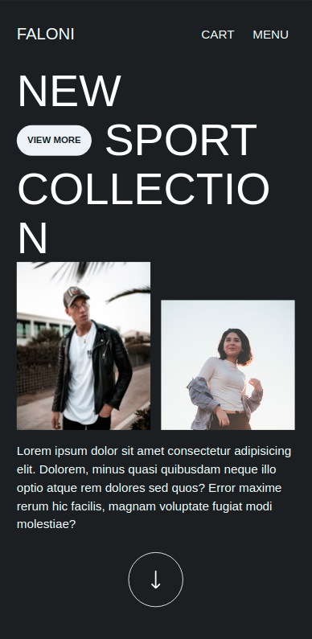
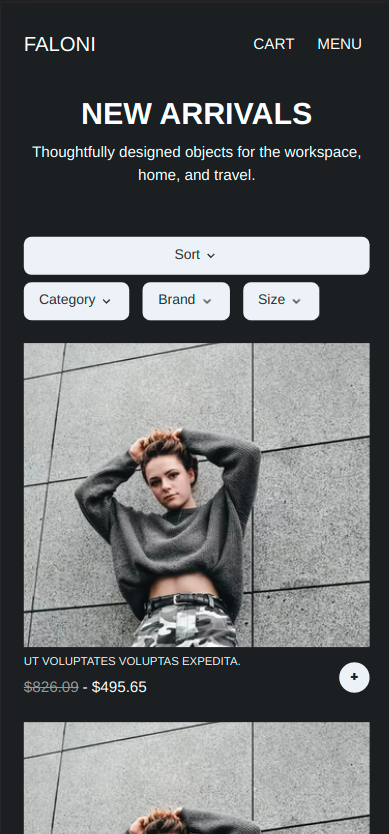
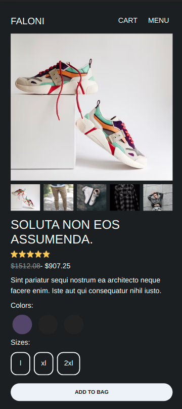
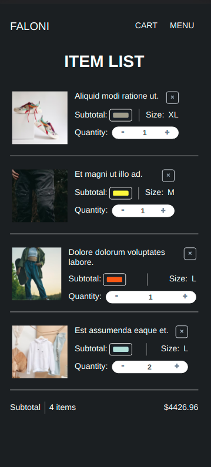

# clothing-shop-app

This project is a clothing shop made in **Nuxt (Vue 2)** and Chakra UI as component library.

### Interesting links

- [Deployment](https://clothing-shop-app.netlify.app)

- [Laravel API repo](https://github.com/AguilarKevin/clothe-shop-api)

---

## About this project

I started this project to practice and apply my knowledge acquired in Vue/Nuxt, I used this [design](https://dribbble.com/shots/15163938-Fashion-E-commerce-Landing-Page) that i found on dribbble.

Note: Desktop design _**in progress**_

 
 

---

### License

[MIT](https://choosealicense.com/licenses/mit/)
